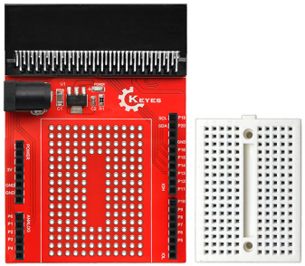
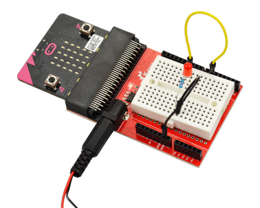

# KE0120 micro bit 原型扩展板V1 含小面包板

## 1. 介绍

micro bit 原型扩展板V1是专为Micro bit主板设计。它把micro bit的所有引脚都以排母的接口方式引出来，方便使用micro bit 搭建电路。

扩展板上有若干个圆形焊盘孔,并包含一块170孔面包板。不仅可以在面包板上搭建试验电路，方便修改。也可把搭好的试验电路直接焊接在扩展板的小万能板上，通过杜邦线与排母连接，和拓展板组成一个整体设计，非常方便。是叠加电路原型的绝佳选择。

板上集成了一个电源模块可以直接对micro BIT 板供电，也可以增加板的带负载能力。

## 2. 特征

- 电源输入：DC 5-9V
- 输出电压：3.3V
- Micro bit系列兼容，即插即用
- 标识精准，外观简单
- 精致面包板 可拆可粘贴 简单方便

## 3.接线图

